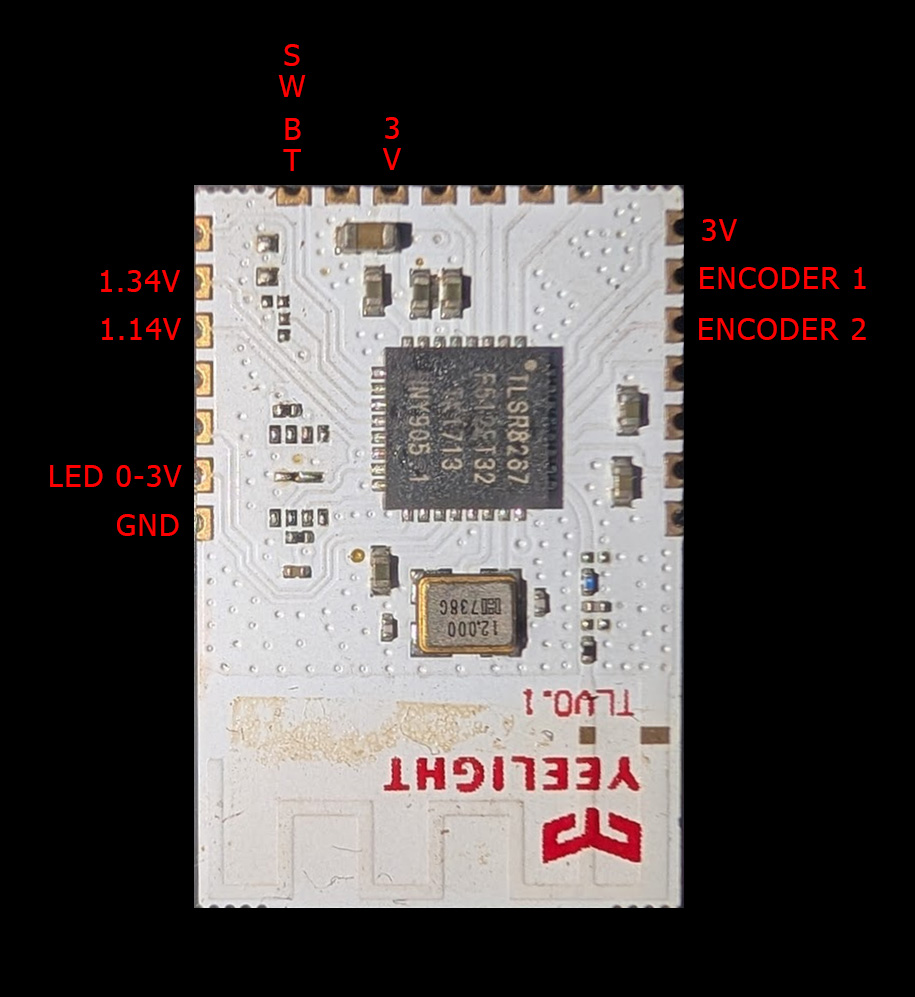
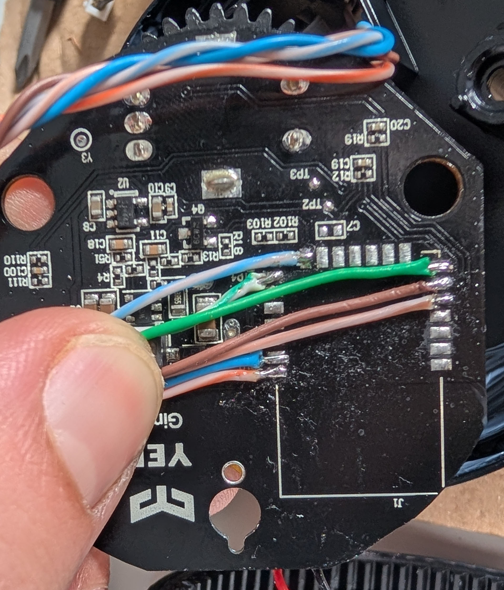
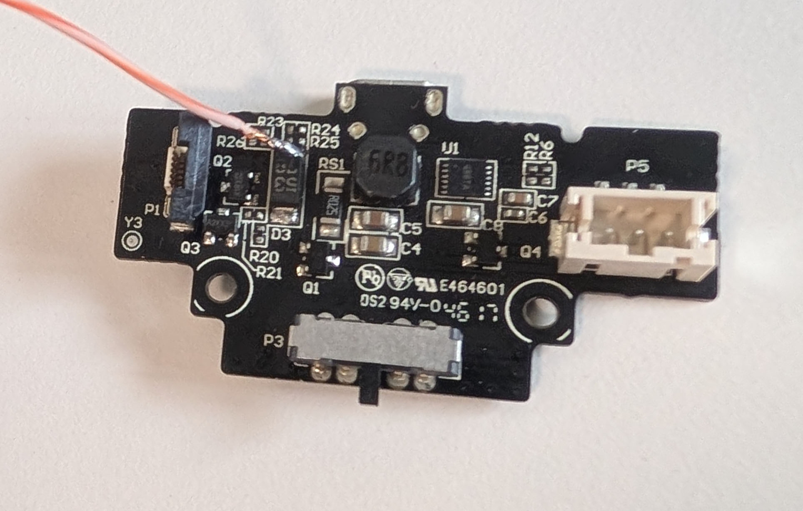
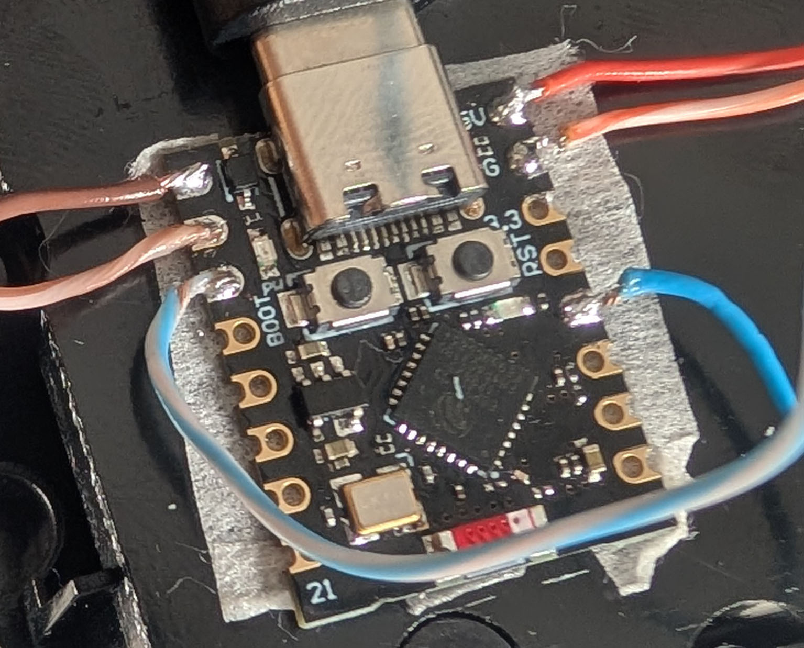

# Yeelight Candela Lamp ESPHome Mod (ESP32-C3 Super Mini)

ESPHome firmware and hardware guide to replace the original Yeelight Candela MCU with an **ESP32-C3 Super Mini**.

---

## Overview

This project shows how to:

* Replace the original MCU with an ESP32-C3 Super Mini
* Wire the lamp correctly
* Flash ESPHome firmware

---

## ⚠️ Disclaimer

This modification requires:
- Soldering skills & basic electronics knowledge  
- A multimeter  
- Solder and wires  
- Hot air gun

Proceed at your own risk.

---

## 📸 Hardware Overview

### Original Daughter Board Layout

### Wiring to Main Board

### Wiring to Power Board

### ESP32-C3 Super Mini Integration

---

## 🔧 Procedure

### 1. Disassembly

1. Apply gentle hot air to the bottom rubber to soften the glue and remove it.
2. Remove screws and plastic base (watch flex cable and battery wires).
3. Remove plastic tube and unscrew the 4 metal base screws.
4. Access battery, support structure, and main PCB (encoder + daughter board).

---

### 2. Remove the daughter board

Apply hot air and gently lift the board until it detaches. Avoid overheating.

---

### 3. Wiring + ESP32 Integration

| Lamp Signal      | ESP32-C3 Pin | Notes                         |
| ---------------- | ------------ | ----------------------------- |
| GND              | GND          | Common ground                 |
| LED              | GPIO3        | PWM (0–3V brightness control) |
| Encoder 1        | GPIO5        | Rotary input                  |
| Encoder 2        | GPIO6        | Rotary input                  |
| Bluetooth Switch | GPIO7        | Optional / not used           |
| 3V               | 3V3          | Optional / not used           |

> ⚠️ The ESP32-C3 Super Mini must be powered by soldering a wire from the **5V pin** to the **D3 pad (Micro-USB side) on the power board**.

> **Note:** Keep wires short and secure. Double-check connections before powering.

---

### 4. Flash firmware

Flashing can be done through the **ESPHome interface** using the provided YAML file.

> **Note:** Replace IP_ADDRESS, HOTSPOT_PASSWORD, OTA_PASSWORD, and ENCRYPTION_KEY with your own values.

---

### 5. Re-assembly

* Create a small hole in the plastic base and bottom rubber
* Fit the ESP32-C3 Super Mini in that space

---

## 🏠 Home Assistant Integration

The device appears automatically in Home Assistant via ESPHome and can be controlled like any other light entity.

---

## 🚧 Future Work

1. Remove the ESP32-C3 Super Mini onboard **5V→3V regulator** and power it directly from the lamp’s **3V signal**
2. Read battery level (signal already available on the motherboard)

---

## 📁 Files

* `yeelight-candela-lamp.yaml` → ESPHome configuration

---

## 💡 Tips

* Double-check wiring before powering
* Ensure common ground between all components

---

## 📜 License

MIT License

Permission is hereby granted, free of charge, to any person obtaining a copy of this project to use, modify, and distribute it freely.

This project is provided "as is", without warranty of any kind. Use it at your own risk.
